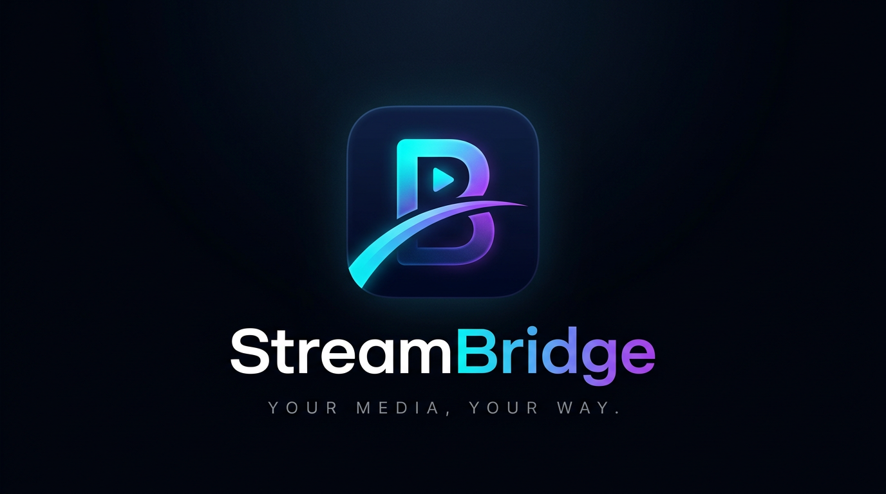

# StreamBridge



**Your media, your way.** StreamBridge is a community-maintained, independently
branded media client for **Android and iOS**, built on Kotlin Multiplatform and
Compose with native platform players. Bring your own lawful catalogs, addons,
playlists and media sources; StreamBridge provides no content or bundled providers.

The current source generation is **0.5.5-beta**, based on verified releases of
[Nuvio Mobile](https://github.com/NuvioMedia/NuvioMobile) and
[NuvioMobile Enhanced](https://github.com/luqmanfadlli/NuvioMobile-Enhanced).
StreamBridge is not an official build of either project.

## Release status

This update is developed on **`arena/01a0f91c-mybridge`**, starting from the last
clean StreamBridge baseline. The repository's existing `main` and some older
published releases still contain a separate experimental CloudStream runtime.
**That runtime is not included in this branch or update.** Until the update is
merged, explicitly use this branch when building the no-CloudStream generation.

Check [releases](https://github.com/sascio/MyBridge/releases) for actual downloadable
assets, and [validation status](docs/VALIDATION-0.5.5.md) before treating a build as
release-ready. A source version, a green unrelated job, an unsigned IPA or a CI
APK does not mean a signed production release has been published.

## Features

- **Browse and discover:** Home, Search, metadata/details, catalogs, episode
  listings, custom posters/landscape artwork, trailers and source selection.
- **Your sources:** Stremio-compatible HTTP addons and user-installed JavaScript
  plugins; configurable request headers and debrid integration. No default
  catalogs or providers are installed for you.
- **Playback:** Android Media3/ExoPlayer with mpv fallback, HLS quality controls,
  picture-in-picture, subtitles, seek/brightness/volume gestures, volume boost,
  resume progress, next episode/shuffle and external-player handoff.
- **Native iOS playback:** mpv host, Now Playing/audio-session controls, supported
  picture-in-picture, orientation handling and platform external players.
- **Library and tracking:** local/user libraries, watched state, collections,
  continue watching, calendar, downloads, and optional Trakt/Simkl/MDBList sync.
- **Metadata and ratings:** optional TMDB, MDBList and OMDb integrations, title/
  episode user ratings, and fetched episode-score priority across layouts.
- **Profiles and appearance:** avatar selection, profile management, tabs,
  device-local appearance and icon choices, Profile Insight/Taste DNA and facts.
- **Live TV:** user-supplied playlists/EPG with search and filtering. This is not
  a CloudStream provider hierarchy or plugin-loader integration.
- **Settings and privacy:** retained StreamBridge privacy controls, credential
  normalization, device-local preferences and explicit optional telemetry controls.
- **Localization:** 25 resource sets including Bengali and Urdu additions.
- **Updates:** StreamBridge GitHub release channels and architecture-aware Android
  downloads, with production-certificate continuity required for in-place updates.

Not every third-party service is enabled in an unconfigured source build.
Playback depends on the source, format, device decoders and platform limitations.
Feature integration is not a claim that all device-level regressions have passed;
see the validation checklist.

## Platforms and installation

| Platform | Build / distribution model |
| --- | --- |
| Android 7.0+ (API 24) | Four ABI-specific full APKs; separately built optional full AAB |
| iOS 16.1+ | Native StreamBridge Xcode target, device Release archive and IPA export |

### Android

1. Choose a **StreamBridge production-signed** release APK for your device:
   `arm64-v8a` for most modern phones; `armeabi-v7a` for supported older 32-bit
   ARM devices; `x86` / `x86_64` for compatible Intel devices/emulators.
2. Verify the release checksums and allow installation from your download app
   when Android asks. Launch StreamBridge and configure only lawful sources.
3. For an update, retain the same `com.streambridge.app` package and signing
   certificate. Do not uninstall first unless you deliberately want to erase
   local data. A differently signed package cannot update the installed app.

Production names are `StreamBridge-0.5.5-beta-<ABI>.apk`. Build `108` is above
previous StreamBridge builds. The beta channel recognizes beta releases; stable
channel users can opt into beta in Settings. Older release assets are not
substitutes for this no-CloudStream generation.

CI artifacts explicitly contain `-not-production` / `-debug-not-production`.
They are for development and **are not production updates**. Do not bypass the
certificate guard or promote a debug certificate into a release.

### iOS

A signed `StreamBridge-0.5.5-beta.ipa` is available only after a real signed archive
and export succeeds. Ad Hoc (`release-testing`) distribution requires your device
UDID in both app and extension provisioning profiles. App Store/TestFlight and
Enterprise exports have different installation rules.

An unsigned validation IPA requires your own re-signing and is not directly
installable as a production release. See [iOS builds and signing](docs/IOS.md) for
Apple requirements, native architecture, local Xcode setup and distribution
choices. No inherited upstream Apple team or fabricated credentials are used.

## Build from source

During this update, select the clean branch explicitly:

```sh
git clone --branch arena/01a0f91c-mybridge --recurse-submodules \
  https://github.com/sascio/MyBridge.git StreamBridge
cd StreamBridge
python3 .github/streambridge_release.py
```

### Android tools and commands

Use **JDK 17**, Android SDK **37** (minor 0), build tools **37.0.0**, and the
checked-in **Gradle 9.4.1** wrapper. AGP **9.2.0**, Kotlin **2.4.10** and Compose
**1.12.0** are pinned to the verified target catalog, not upgraded speculatively.

```sh
# Universal development debug APK
./gradlew :androidApp:assembleFullDebug

# Shared and full Android host tests
./gradlew :composeApp:check :androidApp:testFullDebugUnitTest

# Four ABI release APKs; unconfigured local release uses non-production signing
./gradlew :androidApp:assembleFullRelease
```

Set `ANDROID_HOME` / `ANDROID_SDK_ROOT`, or an ignored `sdk.dir` in
`local.properties`. Production updates require the established upload key and
strict signing mode, described in [Android signing](docs/SIGNING.md).

AABs and split APKs must be built in **separate invocations** with their own
shrunk-resource layout. See [release/build instructions](docs/RELEASING.md) for
safe staging, checksums, AAB cleanup and CI artifact verification.

### iOS tools and commands

Use macOS, **Xcode 26.6**, JDK 17 and Python 3.12. Swift Package Manager uses the
pinned MPVKit submodule; the bootstrap verifies the Apple engine archive checksum.
No CocoaPods step is required.

```sh
./scripts/prepare-ios-dependencies.sh
./scripts/build-ios-archive.sh unsigned
```

Open `iosApp/iosApp.xcodeproj`, select scheme **StreamBridge**, and configure your
own Apple team/profiles for local signed development. Full Release linking is
memory-intensive; the archive tooling budgets 8 GiB for its Gradle/Native
compiler. See [iOS instructions](docs/IOS.md) before exporting a signed IPA.

## Optional runtime configuration

API/OAuth settings can be supplied through ignored `local.properties`; CI accepts
the optional GitHub Secret `NUVIO_LOCAL_PROPERTIES_BASE64`. Existing `NUVIO_*`
secret/property names remain technical compatibility identifiers, not app branding.
Do not commit or paste actual credentials, signing files, tokens or passwords.
See [runtime credentials](docs/UPSTREAM-CREDENTIALS.md).

Service/account/backend names remain accurate. A Nuvio-operated account/backend
or supporter entitlement is not relabeled as a StreamBridge-operated service.
Optional integrations keep their real Trakt, Simkl, TMDB and MDBList identities.

## Architecture

- `composeApp/`: shared UI, models, repositories, navigation, addons, library,
  profiles, tracking, preferences, plus Android/iOS implementations.
- `androidApp/`: Android application host, build variants, manifest and signing.
- `iosApp/`: native Swift host/player, download widget/Live Activity, Xcode target,
  StreamBridge assets and generated version configuration.
- `MPVKit/`: exact pinned native Swift package/submodule, not a moving dependency.
- `gradle/`: shared version catalog and wrapper.
- `streambridge.version.properties`: canonical release/build numbers and exact
  verified source commits for both upstream releases.
- `.github/` and `scripts/`: source/identity/license guards, metadata tests,
  Android packaging, native archives, secure signing and coordinated draft releases.
- `legacy/streambridge-app/`: an unbuilt historical prototype under its separate
  MIT license; not the Android or iOS application described here.

Kotlin packages such as `com.nuvio.*`, generated Compose resource names and some
stored keys remain intentionally stable for interoperability/data compatibility.
The Android/iOS product and bundle identities are StreamBridge. See the
[branding audit](docs/BRANDING-AUDIT-0.5.5.md), [synchronization record](docs/UPSTREAM-SYNC-0.5.5.md)
and [file provenance map](docs/upstream-sync-0.5.5-files.tsv).

## Credits and licensing

StreamBridge adapts work by **NuvioMedia**, **luqmanfadlli**, the NuvioMobile and
Enhanced contributors, and the many open-source projects used by those clients.
We retain upstream copyright notices, source attribution and license terms;
independent branding does not change those obligations.

The runnable application is distributed under the **GNU GPL v3** terms in
[LICENSE](LICENSE) and [COPYING](COPYING). Nuvio Engine is GPL-3.0-or-later and
includes its separately licensed libtorrent, Boost and OpenSSL notices. mpv,
FFmpeg/MPVKit, AndroidX/Media3, Kotlin/Compose and other libraries retain their
respective licenses; Noto fonts retain their SIL Open Font License notice.
See [NOTICE](NOTICE) and [third-party audit](docs/THIRD-PARTY-0.5.5.md).
Provide corresponding source and retained third-party notices when distributing
binaries; do not strip attribution to make the application look original.

## Contributing

Prefer small, reviewed changes with tests and an explicit upstream source pin.
Do not auto-merge moving upstream branches or the unrelated CloudStream experiment.
Report the affected platform, version, architecture and reproducible steps without
posting passwords, private URLs, API tokens or copyrighted content. Real-device
playback, source-picker, subtitle, download and tracking checks are still required
before a maintainer publishes a beta.
